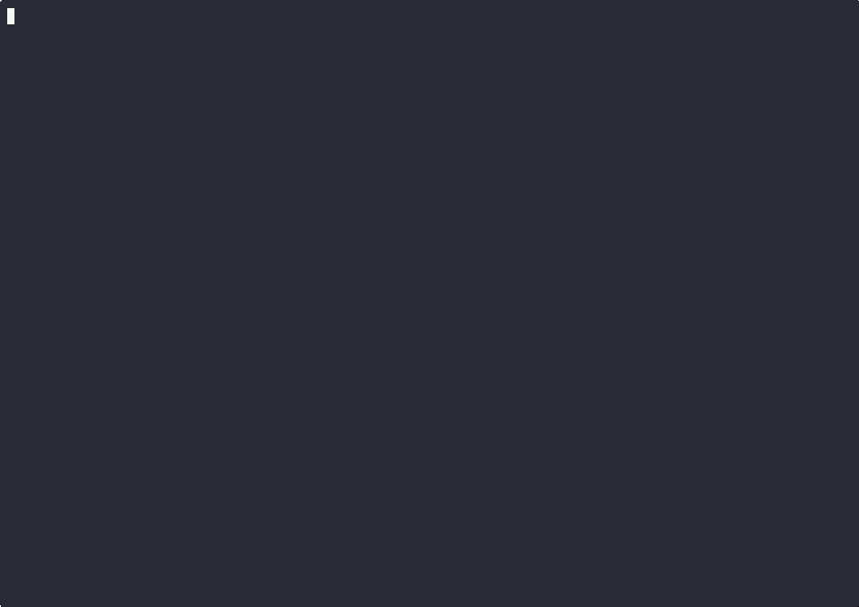

# kubefence

> **⚠️ Proof of concept — not for production use.**
> This is experimental test code. It is provided as-is with no guarantees of
> stability, security, or support.

An [NRI (Node Resource Interface)](https://github.com/containerd/nri) plugin for Kubernetes that
transparently sandboxes container commands using [nono](https://nono.sh), a kernel-enforced
sandbox CLI built on Linux Landlock. 
It should be pretty straightforward to switch from nono to an alternative process sandboxing mechanism.

**Kata Containers is the default and preferred runtime.** The plugin intercepts container
creation and prepends `nono wrap` to `process.args` via `ContainerAdjustment.SetArgs()`.
Runc is supported as an opt-in alternative.

There are multiple reasons for Kata containers being the preferred runtime

- Kata containers runs the pod in a separate VM, thereby prividing additional
  protection to the worker node on container escapes. With Kata the container
  must escape the VM protection as well.
- Ability to use a specific kernel config for the workloads, since pods runs in a VM
- Execs triggered via `kubectl exec` is **blocked at the kata-agent level for
  Kata pods**.

If you are using this for `runc` ensure you disable exec via admission policies.
An example is using [Kyverno](https://kyverno.io/policies/other/block-pod-exec-by-pod-name/block-pod-exec-by-pod-name/)

## Threat Model

nono-nri protects the **host worker node** from the workloads.

**Trusted** — the host side and everything it provides to the guest:
- The host OS, its kernel, and all binaries running on it
- The nono-nri plugin itself and the nono binary it distributes
- Everything the host injects into the container at creation time: the
  `/nono` bind-mount, the `SetArgs` override that installs nono as PID 1,
  and the `NONO_PROFILE` / `PATH` environment variables

**Untrusted** — anything inside the container after it starts:
- The container workload and all processes it spawns
- Any code or data arriving from the network inside the container

**What is enforced:**
Landlock LSM restrictions are applied by nono before the container's own code
runs. Because Landlock is a kernel mechanism, a compromised process inside the
container cannot remove or weaken its own restrictions. Restrictions are also
inherited across `exec`, so child processes remain confined.

**What is not enforced:**
nono-nri constrains filesystem access. It does not restrict network access,
syscalls (beyond what seccomp provides separately), or inter-process
communication. A workload that bypasses the filesystem entirely (e.g. via
`mmap`/JIT) is not constrained by Landlock.

---

## Demo

**python-dev** — automated Job showing Landlock filesystem isolation (non-interactive):


**node-dev** — manual exec into baseline vs sandboxed pod (interactive):


**kata-sandbox** — nono inside a Kata Containers QEMU/KVM micro-VM; nono binary delivered via virtiofs bind-mount, no initrd embed:



See [`contrib/`](contrib/) for manifests, Dockerfiles, and full demo scripts.

## How It Works

1. A pod is created with `runtimeClassName: kata-nono-sandbox`
2. The NRI plugin receives the `CreateContainer` event from CRI-O or containerd
3. The plugin prepends `/nono/nono wrap --profile <profile> --` to the container's `process.args`
4. The container starts — nono applies the Landlock sandbox and `exec()`s into the original command
5. The container process runs kernel-enforced sandboxed; nono has replaced itself

```
Pod spec: command: ["myapp", "--flag"]
                    ↓ NRI plugin
OCI spec: args:   ["/nono/nono", "wrap", "--profile", "default", "--", "myapp", "--flag"]
                    ↓ container start (inside Kata VM)
PID 1:    /usr/bin/myapp --flag   (nono exec'd the app; kubectl exec blocked by OPA)
```

## Container image

Published images (built by CI on every release):

| Image | Contents |
|-------|----------|
| `ghcr.io/kubefence/kubefence:latest` | NRI plugin (`10-nono-nri`) + `nono` sandbox binary |
| `ghcr.io/kubefence/kata-kernel-landlock:latest` | Kata guest kernel with `CONFIG_SECURITY_LANDLOCK=y` |
| `ghcr.io/kubefence/kata-rootfs-nono:latest` | Kata rootfs with `nono` binary pre-installed |
| `ghcr.io/kubefence/charts/nono-nri:latest` | Helm charts for deployment |


## Requirements

| Component | Minimum version |
|-----------|----------------|
| Linux kernel | 5.13+ (Landlock LSM) |
| CRI-O | 1.35+ (NRI with `AdjustArgs` support) |
| containerd | 2.2.0+ (NRI with `AdjustArgs` support) |

## Deploy

### Kata Containers (containerd)

Kata adds a second enforcement layer: each pod runs inside a QEMU/KVM
micro-VM and `kubectl exec` is blocked at the hypervisor by the kata-agent
OPA policy. The nono Landlock sandbox runs inside the VM.

**Prerequisites:** containerd 2.2.0+, Linux 5.13+, Helm 3.x, KVM
(`/dev/kvm` available on nodes).

**Step 1 — Install kata-deploy**

```bash
helm upgrade --install kata-deploy \
  oci://ghcr.io/kata-containers/kata-deploy-charts/kata-deploy \
  --version 3.28.0 \
  --namespace kube-system \
  --set k8sDistribution=k8s \
  --set shims.disableAll=true \
  --set shims.qemu.enabled=true \
  --wait --timeout 10m

kubectl rollout status daemonset/kata-deploy -n kube-system --timeout=5m
```

**Step 2 — Install nono-nri with Kata support**

```bash
helm upgrade --install nono-nri \
  oci://ghcr.io/kubefence/charts/nono-nri \
  --version 1.0.0 \
  --namespace kube-system \
  --set kata.enabled=true \
  --set runtimeClasses.kataNono.enabled=true \
  --set runtimeClasses.kataNono.handler=kata-nono-qemu \
  --set "config.runtimeClasses={nono-runc,kata-qemu,kata-nono-qemu}" \
  --set "config.vmRootfsClasses={kata-nono-qemu}" \
  --wait
```

The `kata-setup` DaemonSet will:
- Pull `ghcr.io/kubefence/kata-kernel-landlock:latest` and install the
  Landlock-enabled `vmlinux` onto each node
- Pull `ghcr.io/kubefence/kata-rootfs-nono:latest` and install the
  confidential rootfs (with `nono` pre-installed) onto each node
- Patch the kata QEMU config to use the Landlock kernel
- Create `configuration-kata-nono-qemu.toml` referencing the nono rootfs
- Register the `kata-nono-qemu` runtime handler in containerd

**Step 3 — Verify**

```bash
kubectl rollout status daemonset/nono-nri-node-setup  -n kube-system
kubectl rollout status daemonset/nono-nri-kata-setup  -n kube-system
kubectl rollout status daemonset/nono-nri              -n kube-system

# Two RuntimeClasses should exist
kubectl get runtimeclass nono-runc kata-nono-sandbox
```

Apply the `kata-nono-sandbox` RuntimeClass to workloads:

```yaml
spec:
  runtimeClassName: kata-nono-sandbox
  containers:
    - name: myapp
      image: myimage:latest
```

This gives two enforcement layers: Landlock filesystem confinement inside
the VM, and `kubectl exec` blocked at the hypervisor by the kata-agent OPA
policy (`deploy/kind/kata-rootfs/policy.rego`).

Optionally override the nono profile per pod:

```yaml
metadata:
  annotations:
    nono.sh/profile: "strict"
```

**Upgrade nono-nri** (updates all three images atomically):

```bash
helm upgrade nono-nri \
  oci://ghcr.io/kubefence/charts/nono-nri \
  --version 1.1.0 \
  --namespace kube-system \
  --reuse-values
```

### runc (containerd)

Deploy on any containerd cluster. The Helm chart automatically enables NRI
and registers the `nono-runc` handler on every node via a privileged
DaemonSet — no manual containerd config changes required.

**Prerequisites:** containerd 2.2.0+, Linux 5.13+, Helm 3.8+.

```bash
# Install nono-nri
helm upgrade --install nono-nri \
  oci://ghcr.io/kubefence/charts/nono-nri \
  --version 1.0.0 \
  --namespace kube-system \
  --wait

# Verify all three DaemonSets are ready
kubectl rollout status daemonset/nono-nri-node-setup -n kube-system
kubectl rollout status daemonset/nono-nri            -n kube-system
```

Apply the `nono-runc` RuntimeClass to workloads:

```yaml
spec:
  runtimeClassName: nono-runc
  containers:
    - name: myapp
      image: myimage:latest
```

## Verify

```bash
# Apply a test pod
kubectl apply -f deploy/test-pod.yaml
kubectl wait --for=condition=ready pod/nono-test --timeout=60s

# nono exec()s into sleep — /proc/1/cmdline shows the original command
kubectl exec nono-test -- cat /proc/1/cmdline | tr '\0' ' '
# → sleep infinity

# nono binary is bind-mounted into the container
kubectl exec nono-test -- ls -la /nono/nono
# → -rwxr-xr-x 1 root root ... /nono/nono

# Check plugin decision logs
kubectl logs -n kube-system -l app.kubernetes.io/name=nono-nri | grep nono-test
# → {"msg":"injected","decision":"inject","pod":"nono-test","profile":"default",...}

# Cleanup
kubectl delete pod nono-test
```

## Configuration

`/etc/nri/conf.d/10-nono-nri.toml`:

```toml
# RuntimeClass handler names to intercept (matches pod.GetRuntimeHandler())
runtime_classes = ["nono-runc"]

# nono profile when pod has no nono.sh/profile annotation
default_profile = "default"

# Host path to the nono binary (copied there by the DaemonSet init container)
nono_bin_path = "/opt/nono-nri/nono"

# NRI socket (empty = use runtime default: /var/run/nri/nri.sock)
socket_path = ""
```

The `nono.sh/profile` annotation value is validated against `^[a-zA-Z0-9][a-zA-Z0-9_-]{0,63}$`.
Invalid values are silently ignored and fall back to `default_profile`.

## CI

Images are published automatically on each release. See [DEVELOPMENT.md](DEVELOPMENT.md) for CI workflow details.

## Contributing

See [DEVELOPMENT.md](DEVELOPMENT.md) for build instructions, local development with Kind, and project layout.

## License

[Apache 2.0](LICENSE)
